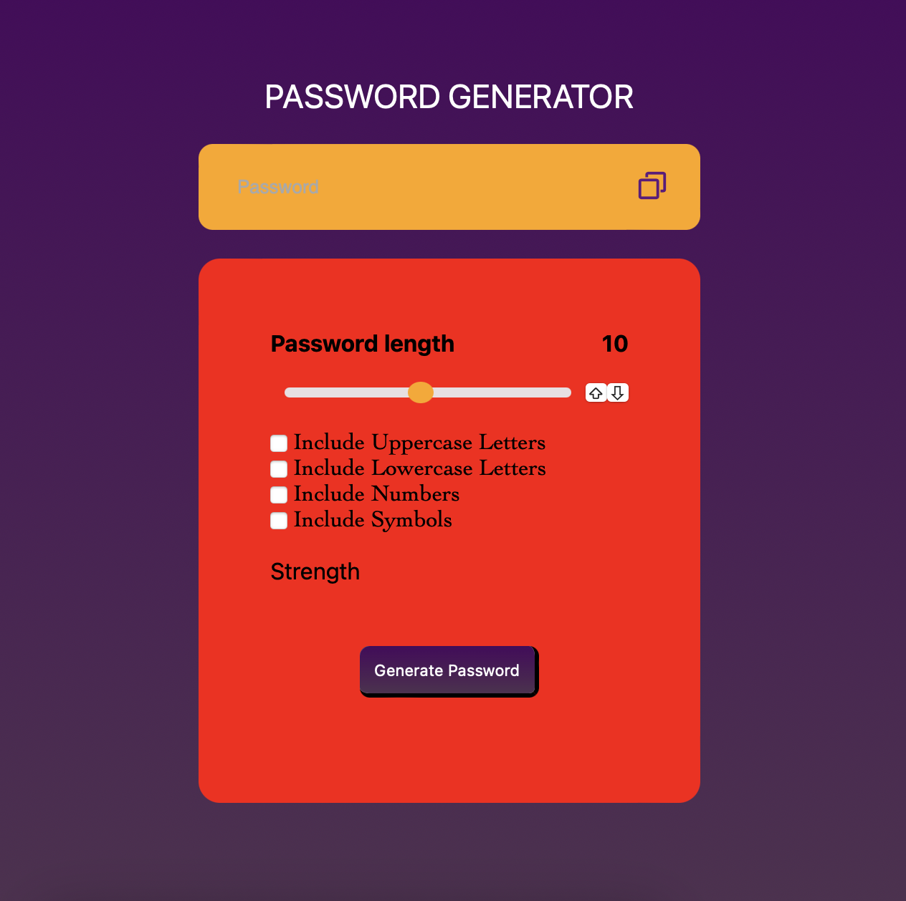

<h1>Password Generator</h1>
<h3>This is a password generating application to help generate random passwords based on the requirements of the user. In this project I use random method of built-in math object.</h3>

⭐️The password🔒can contain uppercase letters, lowercase letters, numbers and symbols. User can mark the checkbox which he wants to include. 
⭐️The user is also provided the functionality of choosing the length of password using sliders and up, down buttons.The length has to be between 1 to 20 
⭐️After that password🔒 is generated user can copy it by clicking the copy button. 
⭐️It also contain an indicator to show the strength of password, green indicates strong password, yellow indicates medium password and red indicates weak password.

